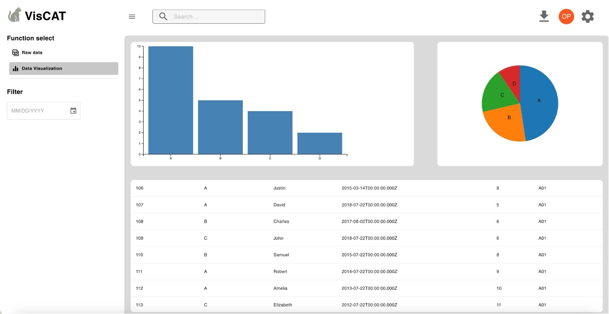

# Viscat test Online Dashborad

[Link for instruction](https://youtu.be/LpWXKtgOasY)

## Introduction

This web service system is an online dashboard system, used to analyze data from Viscat visual disease testing and enable the teachers to enter students' information into our system. The admin of the dashboard system and the users approved by the admin can access our dashboard to view all test results and their analysis. For teachers who going to hold the tests for their students, this system will allow them to enter students and class information

## Overview

web service's architectural


dashboard website design


### Environment

- **Node.js Version:** 18.16+ | **Source:** [Node.js Official Website](https://nodejs.org/en)
- **MongoDB Version:** 6.0.9+ | **Source:** [MongoDB Official Website](https://www.mongodb.com/try/download/community)

### How to Run

Follow these steps to run the project:  
 0. **Download ZIP file from github**

```
cd your file location should be here   eg. cd project-main
then press ls
make sure it show
backend		frontend
```

1. **Delete the `node_modules` folder:**
   Run the following command in the project's root directory to delete the `node_modules` folder: **do not delete package.json**
   ```sh
   rm -rf node_modules
   rm package-lock.json(optional)
   ```
2. **then start backend and frontend fron terminal**
   ```
   cd backend
   npm install
   npm start
   ```
   scenario: app crashed - waiting for file changes before starting...
   it means this port has been used
   solution:
   Find processes using port 3000
   ```
   //skip this if nothing happend
   //get PID from this Command Line
   lsof -i :3000
   //Terminate the process, change PID to a number
   kill -9 PID
   //for example
   kill -9 7689
   ```
   ```
   cd frontend
   npm install
   npm start
   ```
   it is ok if there are warning, just make sure no error
   If you encounter a different error than the one above, please proceed with the first step: Delete the `node_modules` folder and `package-lock.js`, **do not delete package.json**!!!!!!

### Directory structure

```
├── backend
│   ├── controllers
│   ├── middleware
│   ├── models
│   ├── package-lock.json
│   ├── package.json
│   ├── routes
│   └── server.js
└── frontend
    ├── package.json
    ├── public
    └── src
        ├── App.css                 //ignore
        ├── App.js                  //router management
        ├── Dashboard
        │   └── Dashboard.js        //ignore
        ├── api.js                   //api
        ├── authPages
        │   ├── LoginPage
        │   │   ├── LoginPage.js           //important   login page main
        │   │   ├── LoginPageFooter.js     //important   login submit button, redirection need an account => from /login to /register
        │   │   ├── LoginPageHeader.js     //important
        │   │   └── LoginPageInputs.js     //important
        │   └── RegisterPage
        │       ├── RegisterPage.js        //important   register page main
        │       ├── RegisterPageFooter.js  //important   register submit button, redirection already have account => from /register to /login
        │       └── RegisterPageInputs.js  //important
        ├── index.css              //ignore
        ├── index.js               //ignore
        ├── reportWebVitals.js     //ignore
        ├── serviceWorker.js       //ignore
        ├── shared
        │   ├── components                   //common module for login and register
        │   │   ├── AlertNotification.js    //ignore
        │   │   ├── AuthBox.js              //important   page frame
        │   │   ├── CustomPrimaryButton.js  //important   submit button
        │   │   ├── InputWithLabel.js       //important   input module, read more in LoginPageInputs.js / RegisterPageInputs.js
        │   │   └── RedirectInfo.js         //important   buttom redirection for need an account/already have an account
        │   └── utils
        │       ├── auth.js                //ignore
        │       └── validators.js          //ignore   check email and password format
        └── store
            ├── actions
            │   ├── alertActions.js        //ignore
            │   └── authActions.js         //browsing, deal with login and register and redirect to dashboard after success
            ├── reducers
            │   ├── alertReducer.js         //ignore
            │   └── authReducer.js         //ignore
            └── store.js                   //ignore

### Instruction for reading code
1. Start by examining the existing routers in app.js, such as /login, /register, or /dashboard.
2. Then, go into loginpage.js and pay special attention to the return statement on line 34. Understand which components are present there. Finally, navigate to authbox.js to understand the initial structure of the login and register pages. The code here uses the MUI library.
3. Next, return to loginpage.js. From line 37, you can see that it's importing a tag from LoginPageHeader.js. Go into LoginPageHeader.js to inspect its code structure, and so on.

Tips: Within the authbox tag, you can use <div></div> tags, which might help achieve the left-right sliding effect for the formal version of the login page.

The main focus is on making changes in the authpage folder and the shared/component folder. You are free to add functions and tags, but try to avoid deleting existing functions (excluding HTML tags or visual elements) because some functions are responsible for validation.

```
